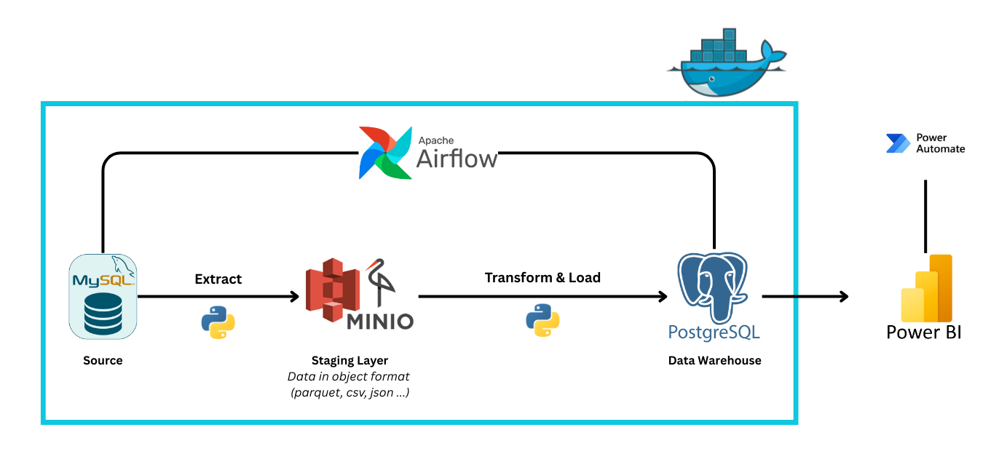

## 📝 Introduction
Đây là một dự án xây dựng hệ thống ETL để phục vụ các báo cáo tài chính (Financial Statements).

---
## 🧩 Components
- **Cơ sở dữ liệu nguồn (MySQL)**  
  Là nơi lưu trữ dữ liệu kế toán gốc phát sinh hằng ngày: giao dịch, bút toán, tài khoản, khách hàng, nhà cung cấp,... Đây là dữ liệu thô, phục vụ cho hoạt động nghiệp vụ.

- **Lưu trữ trung gian (MinIO - S3-compatible storage)**  
  Là nơi lưu tạm dữ liệu đã trích xuất từ MySQL, dưới dạng file (CSV, Parquet,...). Việc sử dụng MinIO giúp:
  - Giảm tải trực tiếp lên MySQL khi xử lý nhiều dữ liệu.
  - Lưu lại bản sao dữ liệu mỗi lần ETL để kiểm tra hoặc khôi phục nếu cần.
  - Tách riêng giai đoạn trích xuất và xử lý, giúp pipeline linh hoạt hơn.

- **Kho dữ liệu (PostgreSQL)**  
  Là nơi lưu trữ dữ liệu đã xử lý và tổ chức lại theo cấu trúc phân tích (star schema). Dữ liệu tại đây được chuẩn hóa để phục vụ cho việc tạo báo cáo, dashboard trên Power BI.
  
---
##  🔄  Data Pipeline

---
## 📊 Dashboard Overview

- **Báo cáo kết quả kinh doanh (Income Statement)**  
  - Theo dõi doanh thu, lợi nhuận gộp, chi phí, lãi ròng,... theo từng quý các năm.  
  - Bao gồm:
    - Biên lợi nhuận gộp / hoạt động / ròng
    - Chi tiết % các loại doanh thu, chi phí

- **Bảng cân đối kế toán (Balance Sheet)**
  - Tổng hợp tài sản, nợ phải trả và vốn chủ sở hữu theo từng quý các năm.  
  - Bao gồm:
    - Phân loại tài sản (ngắn hạn, dài hạn, cố định,...)
    - Cơ cấu nguồn vốn (nợ dài hạn/ngắn hạn, vốn chủ sở hữu, ...)
    - Theo dõi chi tiết các khoản phải thu, tồn kho, đầu tư, khấu hao,...

- **Chỉ số tài chính (Financial Ratios)**
  - Tính toán và biểu diễn các chỉ số theo từng quý các năm.
  - Bao gồm:
    - Đánh giả khả năng sinh lời (ROE, ROA, ROCE)
    - Đòn bẩy tài chính (D/A, D/E)
    - Hiệu suất sử dụng tài sản (Asset Turnover, Fixed Asset Turnover, Working Capital Turnover)
    - Khả năng thanh khoản (Current Ratio, Quick Ratio, Cash Ratio)
    - Khả năng trả nợ (Interest Coverage Ratio, Debt Service Coverage Ratio)
